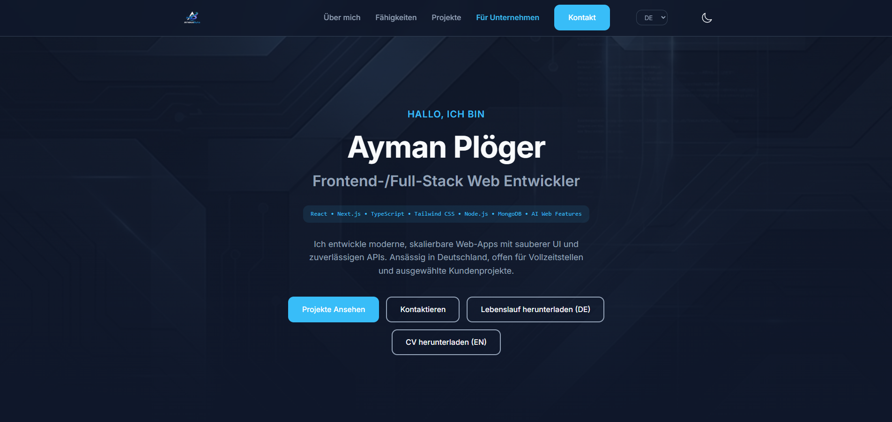

# AymanByte - Portfolio Website

A modern, responsive portfolio website for Ayman Ploeger, focused on frontend/full-stack web development, clean UI, multilingual content and professional project presentation.

## Live Demo

- Netlify: https://aymanbyte-portfolio.netlify.app/

## Pages

- `index.html` - Developer portfolio with about, skills, projects, experience and contact sections
- `clients.html` - Client-facing page with services, process, selected work and contact section

## Features

- Dark / light mode toggle
- Multilingual UI in English, German and Arabic
- RTL support for Arabic
- Responsive layout for mobile, tablet and desktop
- Smooth scrolling and subtle animations
- Downloadable CV buttons in German and English
- Featured project cards with live and GitHub links

## Tech Stack

- HTML5
- CSS3
- JavaScript
- Ionicons

## Deployment

This project is deployed on Netlify and connected to GitHub for continuous deployment.

- Repository: https://github.com/Ploger1979/portfolio
- Live Website: https://aymanbyte-portfolio.netlify.app/

## Contact

- Email: aymanploger@gmail.com
- GitHub: https://github.com/Ploger1979
- Portfolio: https://aymanbyte-portfolio.netlify.app/

(c) 2026 Ayman Ploeger. All rights reserved.
